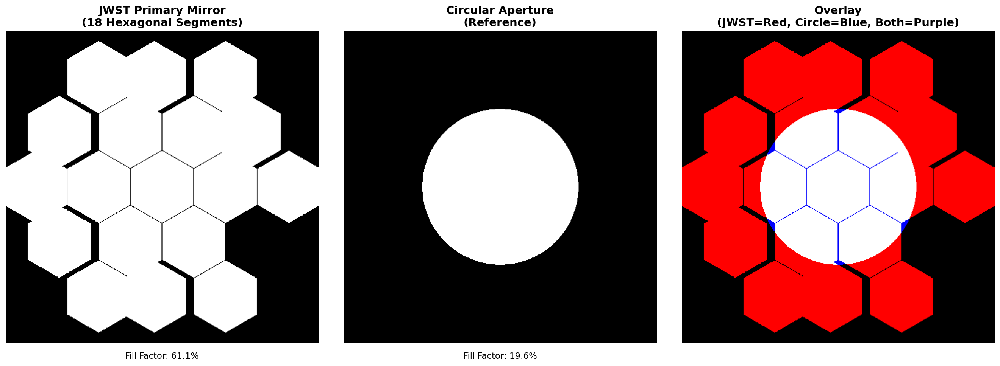
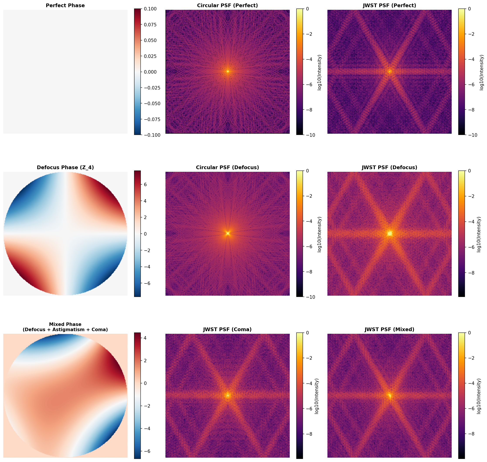

# Neural Wavefront: JWST Phase Retrieval using Deep Learning

<p align="center">
  <em>Predicting wavefront aberrations from Point Spread Functions using Convolutional Neural Networks</em>
</p>

<p align="center">
  <strong>Status:</strong> ✅ Phase 1 Complete (Physics) | ⏳ Phase 2 In Progress (ML Pipeline)
</p>

---

## 🔭 Overview

This project implements a deep learning solution to the **inverse phase retrieval problem** for the James Webb Space Telescope (JWST). Given an observed Point Spread Function (PSF), we use a Convolutional Neural Network to predict the wavefront aberrations (encoded as Zernike polynomial coefficients) that caused it.

### The Physics in Brief

In optical systems like JWST, a telescope mirror acts as a **Fourier computer**:
- Light from a distant star hits the mirror as a wavefront
- The mirror's geometry and any imperfections create a complex electric field
- This field is Fourier-transformed by the optics to create the image we see
- We only observe the **intensity** (PSF), not the phase information

The challenge: Given the PSF image, recover the wavefront errors that produced it.

**Why is this hard?** When we measure intensity ($|E|^2$), we lose phase information. Many different wavefront errors can produce similar-looking PSFs. Traditional iterative algorithms (like Gerchberg-Saxton) are slow. Deep learning offers a fast, learned approach to this inverse problem.

---

## 🎯 Key Features

- **Physics-Based Simulation**: Accurate Fourier optics modeling of JWST's 18-hexagon aperture
- **Zernike Decomposition**: Wavefront errors represented as orthogonal polynomial basis functions
- **Deep Learning Pipeline**: CNN-based regression from PSF to Zernike coefficients
- **Configuration-Driven**: All parameters externalized to YAML for reproducibility
- **Professional Structure**: Modular codebase following software engineering best practices

---

## 📁 Project Structure

```
neural_wavefront/
├── configs/
│   ├── config.yaml              # Main configuration file
│   └── experiments/             # Experiment-specific configs
├── src/
│   └── neural_wavefront/        # Main package namespace
│       ├── __init__.py
│       ├── optics/              # ✅ Physics simulation modules (COMPLETE)
│       │   ├── __init__.py
│       │   ├── pupil.py        # JWST aperture mask generation
│       │   ├── zernike.py      # Zernike polynomial computations
│       │   └── propagation.py  # FFT-based PSF generation
│       ├── data/                # Data generation and loading
│       │   ├── __init__.py
│       │   ├── dataset.py      # PyTorch Dataset classes
│       │   └── generator.py    # Synthetic data creation
│       ├── models/              # Neural network architectures
│       │   ├── __init__.py
│       │   ├── resnet.py       # ResNet-based regressor
│       │   └── loss.py         # Custom loss functions
│       ├── training/            # Training infrastructure
│       │   ├── __init__.py
│       │   ├── trainer.py      # Training loop
│       │   └── metrics.py      # Evaluation metrics
│       └── utils/               # ✅ Utilities (COMPLETE)
│           ├── __init__.py
│           ├── config.py       # Config loading
│           └── visualization.py # Plotting functions
├── scripts/
│   ├── generate_data.py        # Data generation script
│   ├── train.py                # Training script
│   └── evaluate.py             # Evaluation script
├── tests/                       # Unit tests
├── notebooks/                   # Jupyter notebooks for exploration
├── outputs/
│   ├── checkpoints/            # Saved model weights
│   ├── figures/                # ✅ Generated validation plots
│   └── experiments/            # Experiment logs
├── data/
│   └── processed/              # Generated datasets (.npz files)
├── AGENT.md                    # Comprehensive development guide
├── STATUS.md                   # ✅ Current development status
├── README.md                   # This file
└── pyproject.toml              # Package configuration (uv)
```

---

## 🚀 Installation

This project uses **uv** for package management.

### Prerequisites
- Python ≥ 3.11
- uv package manager ([installation guide](https://github.com/astral-sh/uv))

### Setup

```bash
# Clone the repository
git clone https://github.com/yourusername/neural_wavefront.git
cd neural_wavefront

# Install dependencies using uv
uv pip install -e .

# (Optional) Install development dependencies
uv pip install -e ".[dev]"
```

---

## 📊 Quick Start

### 1. Generate Synthetic Data

```bash
uv run python scripts/generate_data.py
```

This creates training, validation, and test datasets by:
- Randomly sampling Zernike coefficients
- Generating JWST aperture masks
- Computing PSFs via FFT
- Saving to `data/processed/jwst_dataset.npz`

### 2. Train the Model

```bash
uv run python scripts/train.py
```

Trains a ResNet-based CNN to predict Zernike coefficients from PSF images. Checkpoints are saved to `outputs/checkpoints/`.

### 3. Evaluate Results

```bash
uv run python scripts/evaluate.py
```

Generates evaluation metrics and visualizations:
- Predicted vs. ground truth coefficient scatter plots
- PSF reconstruction comparisons
- Per-mode error analysis

---

## 📐 The Physics: How It Works

### 1. Wavefront Representation

Any wavefront error can be decomposed into **Zernike polynomials** ($Z_j$):

$$\phi(x, y) = \sum_{j=1}^{N} a_j \cdot Z_j(r, \theta)$$

where:
- $a_j$ are coefficients (what we predict)
- $Z_j$ are orthogonal polynomials (defocus, astigmatism, coma, etc.)

### 2. PSF Generation (Forward Model)

The Point Spread Function is the intensity of the Fourier-transformed pupil field:

$$\text{PSF}(u, v) = \left| \mathcal{F}\left\{ A(x,y) \cdot e^{i\phi(x,y)} \right\} \right|^2$$

where:
- $A(x,y)$ is the JWST 18-hexagon aperture mask
- $\phi(x,y)$ is the wavefront error
- $\mathcal{F}\{\cdot\}$ is the 2D Fourier transform

### 3. Inverse Problem (Neural Network)

Given a PSF image, a CNN learns to predict the coefficients $\{a_j\}$ that produced it.

**Network Architecture**: ResNet-18 backbone
- Input: 256×256 grayscale PSF (log-scaled)
- Output: 15 Zernike coefficients
- Loss: Mean Squared Error (MSE)

---

## 🔧 Configuration

All parameters are defined in [`configs/config.yaml`](configs/config.yaml):

```yaml
simulation:
  grid_size: 256
  wavelength: 2.0e-6      # 2 microns (JWST NIRCam)
  num_segments: 18        # JWST hexagons

zernike:
  max_order: 5
  n_modes: 15

training:
  learning_rate: 0.001
  epochs: 50
  batch_size: 32
```

**No hardcoded values** in source code—everything is configurable!

---

## 📈 Results

### ✅ Phase 1: Physics Validation

All physics modules have been implemented and validated with visual outputs.

#### Zernike Polynomial Basis


*First 8 Noll-indexed Zernike modes on a 256×256 grid. From left to right, top to bottom: Piston (Z₁), Tip (Z₂), Tilt (Z₃), Defocus (Z₄), Astigmatism (Z₅, Z₆), Coma (Z₇, Z₈). Orthogonality validated numerically.*

#### JWST Aperture Geometry



*Left: JWST 18-hexagonal segment primary mirror mask (512×512 grid). Right: Horizontal cross-section comparison between JWST aperture (blue) and circular reference (orange dashed). Fill factor: 61.13%*

#### PSF Propagation Validation



*Point Spread Functions generated via FFT-based Fourier optics. Top row: JWST aperture (left) and circular aperture (right) with perfect wavefront showing clean diffraction patterns. Bottom rows: PSFs with various aberrations - defocus (Z₄ = 0.5λ), coma (Z₇ = 0.3λ), and mixed aberrations. Note the characteristic 6-pointed star pattern from JWST's hexagonal geometry.*

### ⏳ Phase 2: Training Results (Coming Soon)

- Training loss curves
- Predicted vs. true Zernike coefficients
- PSF reconstruction quality
- Per-mode error analysis

---

## 🧪 Development Guide

For AI agents and developers working on this codebase, see **[AGENT.md](AGENT.md)** for:
- Detailed physics derivations
- Implementation requirements and guardrails
- Phase-by-phase development instructions
- Testing and validation criteria

### Running Tests

```bash
pytest tests/
```

### Code Quality

```bash
# Format code
black src/ scripts/ tests/

# Sort imports
isort src/ scripts/ tests/

# Type checking
mypy src/
```

---

## 📚 References

1. **JWST Documentation**: [NASA JWST User Documentation](https://jwst-docs.stsci.edu/)
2. **Zernike Polynomials**: Noll, R. J. (1976). *J. Opt. Soc. Am.* 66(3), 207-211
3. **Phase Retrieval**: Fienup, J. R. (1982). *Applied Optics* 21(15), 2758-2769
4. **Deep Learning for Optics**: [Paine et al. (2018)](https://arxiv.org/abs/1803.03624)

---

## 🎓 For Recruiters

This project demonstrates:

- ✅ **Physics & Mathematics**: Fourier optics, wavefront sensing, orthogonal polynomials
- ✅ **Machine Learning**: PyTorch, CNN architectures, training pipelines
- ✅ **Software Engineering**: Modular design, configuration management, testing
- ✅ **Domain Application**: Real-world problem (JWST operations)
- ✅ **Documentation**: Clear explanations, reproducible results

**Key Skills**: Python, Deep Learning, Scientific Computing, Version Control

---

## 📝 License

MIT License (see [LICENSE](LICENSE) file)

---

## 🤝 Contributing

Contributions are welcome! Please:
1. Fork the repository
2. Create a feature branch
3. Follow the code style (black, isort)
4. Add tests for new functionality
5. Submit a pull request

---

## 📧 Contact

For questions or collaboration: [your.email@example.com](mailto:your.email@example.com)

---

<p align="center">
  <em>Built with ❤️ for advancing wavefront sensing through deep learning</em>
</p>
